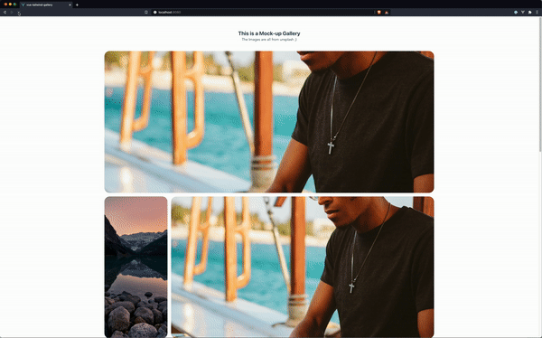

# **vue-tailwind-gallery**
## _A ❤️ between tailwindcss and vue-js_

<br>
While learning vue-js to build my own website I searched for a nice and clean image gallery that works as a component and also uses the tailwindcss framework. <br>
And because i did not find anything, i had to try it myself. 

Therefore I present:<br>
**The Tailwind ❤️ Vue-JS Gallery**

It may not be the cleanest code, but im still learning, and going to improve, as well as add new Gallery styles to this project. <br>
Feel free to hit me up with suggestions or opinions how to improve to code. :) 
<br><br>
## *The Gallery*


The whole area is covered by a 5 column grid. The script assigns the value how much space the img is going to get based on a random number. <br>
To assign the space the tailwindcss class 
*`col-span-[number]`*
is used.
<br>
The *"gallery.vue"* component needs an array of images to initialize itself, so if you want to change those, just edit the array :)

## *TODOS:*
- Adding a lightbox
- maybe giving it some intelligence to assign the values also based on the Image width.

<br>
<br>

______________________
#### Project setup
```
npm install
```
##### Compiles and hot-reloads for development
```
npm run serve
```
##### Compiles and minifies for production
```
npm run build
```
